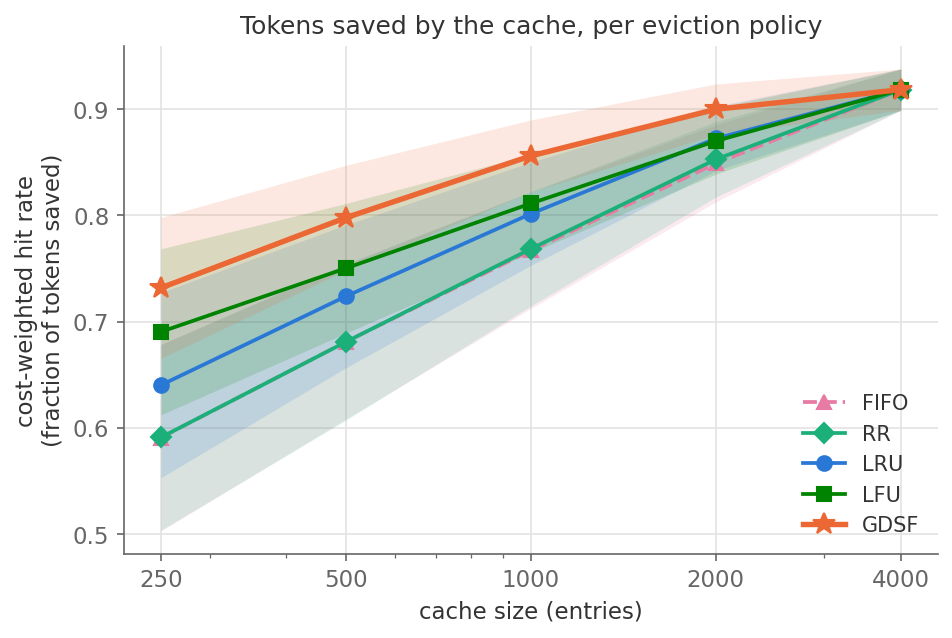

# Cost-Aware Eviction for LLM Semantic Caches

**University final project.** We extend [GPTCache](https://github.com/zilliztech/GPTCache),
the most popular open-source semantic cache for LLMs, with a cost-aware
eviction policy (GDSF — Greedy-Dual-Size-Frequency), and show that it saves
significantly more generation time and money than all four built-in policies.

## The idea in three sentences

GPTCache's built-in eviction policies (LRU, LFU, FIFO, RR) treat every cached
answer as equally valuable. But LLM answers differ by two orders of magnitude
in generation cost: evicting a cached 2,000-token answer costs the user far
more future time and money than evicting a 20-token one. GDSF ranks entries by
`priority = L + frequency × cost` (cost = generated tokens, L = an aging
term), so the cache keeps the answers that save the most work.

## Headline results

10 random seeds, Zipf workloads with realistic response-length skew, paired
bootstrap 95% confidence intervals — every comparison below is statistically
significant (full details in the [report](report/final_report.pdf)):

| GDSF vs. (cache size 1000) | tokens saved | mean latency | p95 latency |
|---|---|---|---|
| LRU (GPTCache default) | +6.8 pts | −26.4% | −27.4% |
| LFU (strongest baseline) | +5.5 pts | −22.5% | −23.9% |



## Installation

Needs Python 3.10+. From the repository root:

```bash
python3 -m venv .venv && source .venv/bin/activate
pip install -e . numpy matplotlib pytest
```

Or with Docker (also runs the tests):

```bash
docker build -t gptcache-gdsf .
docker run --rm gptcache-gdsf
```

## Running the tests

```bash
python -m pytest tests/unit_tests/eviction/ tests/unit_tests/manager/test_eviction.py \
    -q -o addopts="" --ignore=tests/unit_tests/eviction/test_distributed_cache.py
```

19 tests: GPTCache's 8 original eviction tests (unchanged) plus 11 new ones
covering the GDSF policy. The ignored file needs a running Redis server and is
unrelated to in-memory eviction.

## Running the benchmarks

Quick single run (see [benchmarks/README.md](benchmarks/README.md) for all flags):

```bash
cd benchmarks
python run_bench.py --policies LRU,LFU,GDSF --workload zipf \
    --maxsizes 500,1000,2000 --out results/my_run
```

Full experiment suite from the report (about 5 minutes on a laptop, writes
CSV + JSON + figures):

```bash
cd benchmarks
python run_experiments.py --seeds 10 --out results/full
python make_plots.py
```

Everything is seeded and deterministic. CI reruns the tests and a quick
benchmark on every commit
([workflow](.github/workflows/gdsf_benchmark.yaml)).

## Using the policy

```python
from gptcache.manager.eviction import EvictionBase

eviction = EvictionBase("memory", policy="GDSF", maxsize=1000, clean_size=200,
                        on_evict=my_cleanup)
eviction.put(ids, costs=token_counts)  # cost-aware
eviction.put(ids)                      # still works: behaves like LFU with aging
```

Fully backward compatible: the four built-in policies are untouched and
ignore the optional `costs` parameter.

## Repository map

| What | Where |
|---|---|
| GDSF implementation (~90 lines) | `gptcache/manager/eviction/gdsf.py` |
| API integration | `gptcache/manager/eviction/memory_cache.py` |
| Unit tests | `tests/unit_tests/eviction/test_gdsf_cache.py` |
| Benchmark suite + how-to | `benchmarks/` |
| Raw results, stats, figures | `benchmarks/results/` |
| **Project report (PDF)** | `report/final_report.pdf` |
| Baseline choice justification | `report/baseline_justification.md` |
| Report generator (numbers come from the data) | `report/generate_report.py` |

The `main` branch holds the unmodified GPTCache baseline; this branch
(`feature/gdsf-eviction`) adds our work on top —
[see the exact diff](https://github.com/royhouber123/LLM-Cache-final-project/compare/main...feature/gdsf-eviction).

GPTCache's original README is preserved as
[GPTCACHE_README.md](GPTCACHE_README.md) (MIT license).
